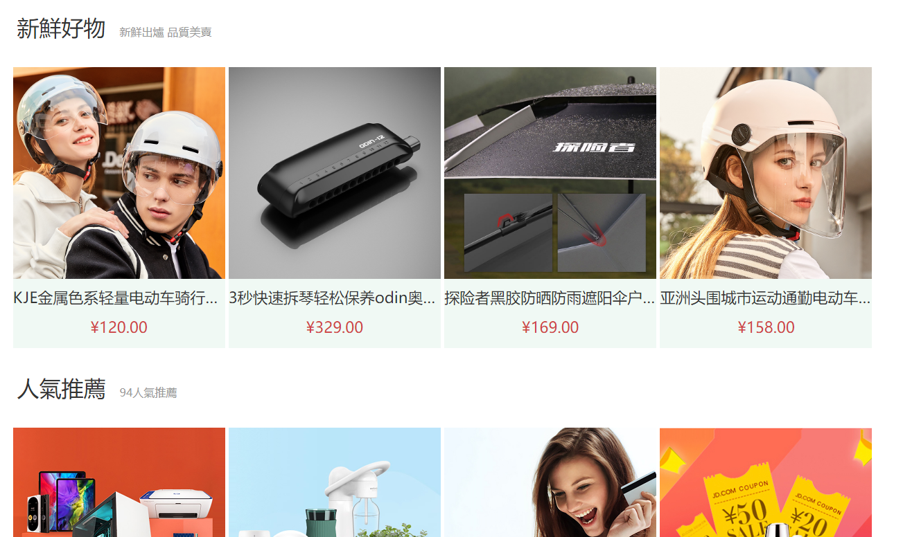
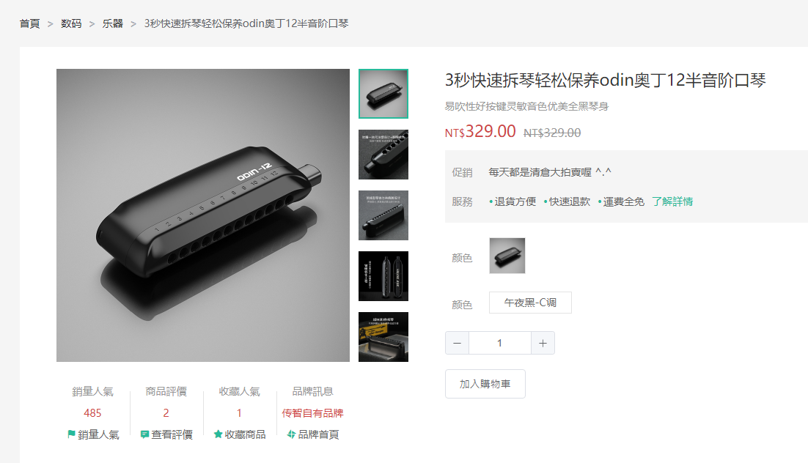
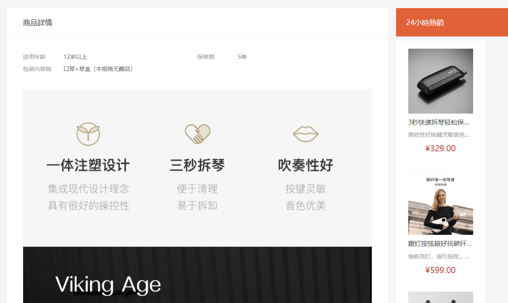
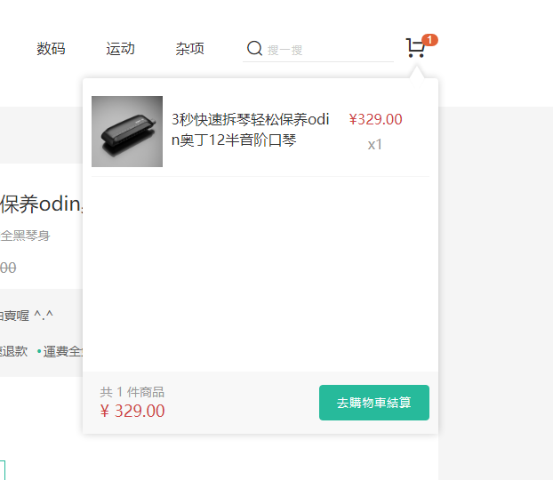
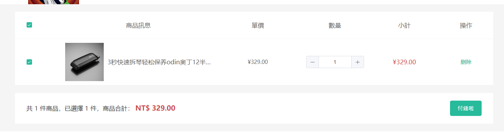
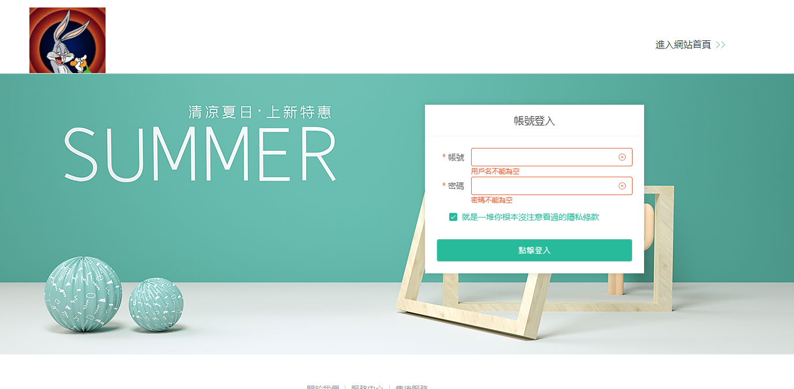

# Ecommerce Website built by Vue3

The project is deployed on [github page](https://freeway26tw.github.io/ecommerce-vue/)

---

Use can browse categories and banners from the home page.

Also the new and hot products

Entering the product page, use can view pictures of the product

Also the details

If you want to view the picture closely, just hover over the picture

After adding the product into the cart, you can see what you collected from here

Click checkout method, you will be directed to the page

Finally, don't forget to login before you checkout.

